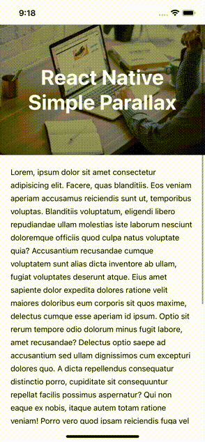

<!-- https://www.pexels.com/pl-pl/zdjecie/biurko-biuro-dane-dokument-374016/ -->

# Parallax animation in React Native

Animations are very important to create a great user experience. Objects in motion will make your application look smooth and more engaging.

In this article I will show you how to create the "parallax" effect in React Native. Let's start!

## Parallax

Prallax refers to the use of visual effects combined with 2D scrolling to create the illusion of depth and layers. This concept uses different background and foreground designs that move at different speeds.

Here is the effect we want to achieve:



While the view is being scrolled the header image moves slower than the scroll y index. Also the title that disappears on scroll is additional feature that improves the UX.

## Let's code! ⌨️

There are many libraries that may simplify writing more complex animations, but for this simple use case I used the [Animated API](https://reactnative.dev/docs/animated) that is built into `react-native` package. It has a lot of functions that allows the smooth transition between states of animating objects.

Let's create the component with Animated ScrollView:

```javascript
import React, { FC } from 'react';
import { Animated } from 'react-native';

const CollapsibleHeaderScrollView: FC = ({ children }) => {
  const scrollY = new Animated.Value(0);

  const onScroll = Animated.event(
    [{ nativeEvent: { contentOffset: { y: scrollY } } }],
    { useNativeDriver: true },
  );

  return (
    <Animated.ScrollView
      onScroll={onScroll}
      scrollEventThrottle={20}
      bounces={false}
    >
      {children}
    </Animated.ScrollView>
  );
};
```

Firstly I defined the animated value with the initial state using `new Animated.Value(0)` method.

Then in the `onScroll` function I used `Animated.event` method that allows to listen a certain native event (in this case the scroll event). The `scrollY` variable will be updated every time the ScrollView is moved.

You may notice that I passed the second param to the `Animated.event`. By using the `useNativeDriver: true` property, we send everything about the animation to native before starting the animation. Consequently, the performance is improved, because the animation is ran on the native side and not on the JS thread.

Now let's create the header that will animate the `transform: translateY` style on scroll.

```javascript
import React, { FC } from 'react';
import { Animated, View } from 'react-native';

const CollapsibleHeaderScrollView: FC = ({ children, title, image }) => {
  const scrollY = new Animated.Value(0);

  const onScroll = Animated.event(
    [{ nativeEvent: { contentOffset: { y: scrollY } } }],
    { useNativeDriver: true },
  );

  const imageAnimatedStyle = {
    transform: {
      translateY: scrollY.interpolate({
        inputRange: [0, 250],
        outputRange: [0, 125],
      }),
    },
  };

  return (
    <Animated.ScrollView
      onScroll={onScroll}
      scrollEventThrottle={20}
      bounces={false}
    >
      <View style={styles.header}>
        <Animated.Image
          source={image}
          style={[styles.image, imageAnimatedStyle]}
          resizeMode="cover"
        />
        <View style={styles.overlay} />
      </View>
      {children}
    </Animated.ScrollView>
  );
};

const styles = StyleSheet.create({
  header: {
    height: 250,
    overflow: 'hidden',
  },
  image: {
    width: '100%',
    height: '100%',
  },
  overlay: {
    ...StyleSheet.absoluteFillObject,
    backgroundColor: 'rgba(0, 0, 0, 0.4)',
  },
});
```

I used the `interpolate` function that allows animated values to be derived from other animated values. In this case I had to transform `scrollY` value into `translateY` value.

I wanted to make the image animation two times slower than the scroll speed to achieve the nice depth effect. The `inputRange` ends at 250 that is equal to the header height and accordingly the `outputRange` is divided by two.

The parallax effect on our ScrollView is ready 🎉

## More magic 🪄

The parallax looks great, but for some use cases we'll also need the screen title. Let's animate it too!

The effect we want to achieve is the title that disappears on scroll. We'll need to animate `opacity` as well as `transform: translateY` style (because the title has `position: 'absolute';`).

First let's define our animated styles

```javascript
const textAnimatedStyle = {
  transform: {
    translateY: scrollY.interpolate({
      inputRange: [0, 250],
      outputRange: [0, 125],
    }),
  },
  opacity: scrollY.interpolate({
    inputRange: [0, 120, 150],
    outputRange: [1, 0.9, 0],
  }),
};
```

The `transform` style is the same as the previous image styles, because we want to keep the text relatively in the same position as the animated image.

The `opacity` should be decreased in the further stage of the animation. First it animates slowly from 1 to 0.9 (scroll position 0-120) and at the end text disappears 0.9 -> 0 (120-150).

The opacity animation ends at scrollY 150, because I wanted to fully hide the text when the header is still visible.

Now we need to render the animated text

```javascript
const renderText = () => (
  <View style={styles.textWrapper}>
    <Animated.Text style={[styles.text, textAnimatedStyle]}>
      {title}
    </Animated.Text>
  </View>
);

const styles = StyleSheet.create({
  textWrapper: {
    ...StyleSheet.absoluteFillObject,
    justifyContent: 'center',
    alignItems: 'center',
  },
  text: {
    color: 'white',
    paddingHorizontal: 30,
    fontSize: 40,
    fontWeight: 'bold',
    textAlign: 'center',
  },
});
```

## And that's it 💥

We have built beautiful header animation that may diversify the boring UI of many applications.

Feel free to use this idea in your app!

The full component's code can be found [here](https://github.com/aliberski/react-native-parallax-header).
